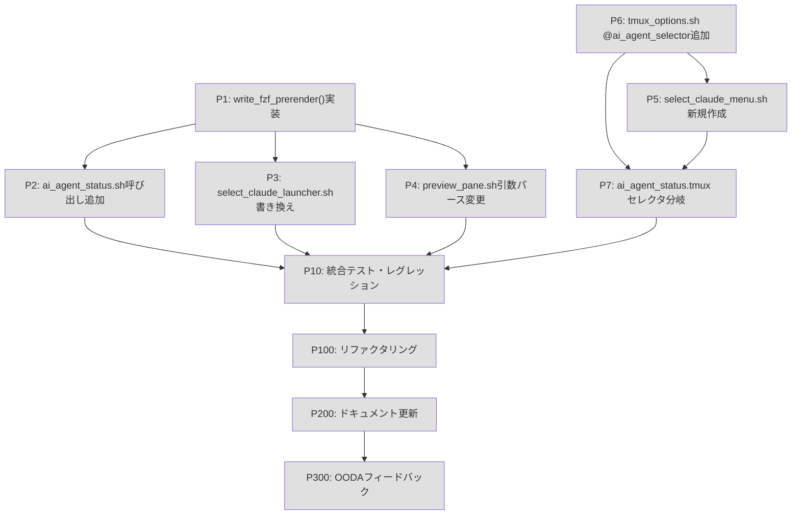

---
# === Mission Identity ===
mission_id: null
title: "絞り込み画面起動速度最適化: プリレンダリング + display-menu"
status: planning
progress: 0
phase: planning

# === TDD Configuration ===
tdd_mode: true
tdd_phase: null

# === OODA Configuration ===
ooda_config:
  enabled: true
  feedback_channels:
    immediate: true
    task: true
    mission: true
    cross: true

# === Execution Configuration ===
execution_mode: sequential
dag_config:
  enabled: true
  max_concurrent: 3
  cascade_failure: true
  visualization: true

# === Deliberation Configuration ===
deliberation:
  enabled: true
  level: auto
  multi_llm: false

# === Context Policy ===
context_policy:
  max_summary_tokens: 500
  detailed_log_path: "stigmergy/doctrine-logs/{mission_id}/"
  aggregation_strategy: progressive_summarization

# === Session Continuity ===
session_continuity:
  continue_mode: true
  previous_mission_id: null
  project_path: "/Users/takets/repos/tmux-ai-agents-status"

# === Timestamps ===
created_at: "2026-03-01"
updated_at: "2026-03-01"
blockers: 0
---

# Commander's Intent

## Purpose
- 現状の絞り込み画面（fzf popup）は起動に400-600msかかり、体感的な遅さが問題
- キー押下から画面表示までを段階的に削減することで、快適な操作感を実現する
- Phase 1（プリレンダリング）で~300ms、Phase 2（display-menu）で~30-50msを目標とする

## End State
- Phase 1完了: キー押下時にfzf popupが従来より高速に開く（~300ms、source不要・プリレンダリング活用）
- Phase 2完了: `@ai_agent_selector menu` 設定でtmux native menuが~30-50msで表示される
- 既存機能（focus, send_prompt, preview）の完全な後方互換性を維持

## Key Tasks
- Phase 1: `write_fzf_prerender()` 実装 + `select_claude_launcher.sh` を~12行に書き換え
- Phase 2: `select_claude_menu.sh` 新規作成 + `@ai_agent_selector` オプション対応
- テスト: 単体・統合・フォールバック・レグレッション検証

## Constraints
- macOS bash 3.2互換性維持（連想配列不使用、POSIX互換構文のみ）
- 既存の `tests/status_detection_test.sh` 等が全パス維持
- `/tmp` 書き込みはatomic（tmp + mv -f）パターンを踏襲
- `focus_session.sh`、`send_prompt.sh` は変更不要

## Restraints
- プリレンダリング未生成時は必ずレガシーフォールバックを実行すること
- プリレンダリング鮮度チェック（10秒）を実施すること
- `@ai_agent_selector` のデフォルトは "fzf"（既存動作を維持）

---

# Context

## 概要
- tmux-ai-agents-status プラグインの絞り込み画面起動速度を3段階で最適化する
- Phase 1: `ai_agent_status.sh`（2秒毎バックグラウンド）でfzf入力データを事前生成し、キー押下時のスクリプトを大幅削減
- Phase 2: fzf不要のtmux native display-menuに切り替え可能なセレクタモードを追加

## 必須のルール
- 必ず `CLAUDE.md` を参照し、ルールを守ること
- **TDD（テスト駆動開発）を厳守すること**
  - 各プロセスは必ずテストファーストで開始する（Red → Green → Refactor）
  - 実装コードを書く前に、失敗するテストを先に作成する
- macOS bash 3.2互換性: 連想配列 (`declare -A`) 不使用、`[[ ]]` は使用可

## 開発のゴール
- キー押下 → fzf popup 表示 の体感遅延を現状(400-600ms)から Phase1:~300ms → Phase2:~30-50ms に削減

## ボトルネック分析

| コンポーネント | コスト | 削減フェーズ |
|---|---|---|
| bash起動+source 5モジュール | ~50ms | Phase 1 |
| tmux show-options (1 IPC) | ~30ms | Phase 1 |
| tmux capture-pane x N (並列) | ~20-50ms | Phase 1 |
| bash regex検出ループ | ~5ms/pane | Phase 1 |
| tmux popup描画 | ~50-100ms | Phase 2 |
| fzf起動 | ~200ms | Phase 2 |

## プリレンダリングファイル形式

```
# /tmp/ai_agent_fzf_prerender
# 各行: 表示文字列\tpane_id（タブ区切り）
🟢2m45s 🍎#2 tmux-ai-agents [main]\t%14
🟡 👻#0 my-api-server [work]\t%3
🔵 ⚡#1 dotfiles [config]\t%8
```

- atomicな書き込み: `/tmp/ai_agent_fzf_prerender.tmp` → `mv -f` で最終パスに移動
- 鮮度チェック: 10秒以上古い場合はレガシーフォールバックを使用

---

# References

| @ref | @target | @test |
|------|---------|-------|
| `scripts/lib/cache_shared.sh` (write_shared_cache, 行26-78) | `scripts/lib/cache_shared.sh` (write_fzf_prerender追加) | `tests/test_prerender.sh` (新規) |
| `scripts/ai_agent_status.sh` (main, 行48-266) | `scripts/ai_agent_status.sh` (write_fzf_prerender呼び出し追加) | `tests/test_prerender.sh` |
| `scripts/select_claude_launcher.sh` (全体~227行) | `scripts/select_claude_launcher.sh` (全面書き換え~12行) | `tests/test_launcher.sh` (新規) |
| `scripts/preview_pane.sh` (行20-34) | `scripts/preview_pane.sh` (引数パース変更) | `tests/test_preview.sh` |
| `scripts/lib/tmux_options.sh` | `scripts/lib/tmux_options.sh` (@ai_agent_selector追加) | `tests/test_detection.sh` |
| `ai_agent_status.tmux` (setup_select_keybinding, 行65付近) | `ai_agent_status.tmux` (セレクタモード分岐) | 手動テスト |
| (新規) | `scripts/select_claude_menu.sh` | `tests/test_menu.sh` (新規) |
| `scripts/focus_session.sh` | 変更不要 | `tests/test_detection.sh` |
| `tests/status_detection_test.sh` | レグレッション検証用 | - |

---

# DAG Execution（並列タスク管理）

## DAG Configuration

| Setting | Value | Description |
|---------|-------|-------------|
| enabled | true | DAG 実行の有効化 |
| max_concurrent | 3 | 最大同時実行タスク数 |
| cascade_failure | true | 失敗時に依存タスクをスキップ |
| partial_execution | true | 部分実行を許可 |
| visualization | true | Mermaid 可視化出力 |

## Task Dependencies Graph



## Parallel Groups

| Group | Tasks | Dependencies | Can Run Parallel |
|-------|-------|--------------|------------------|
| G1 | P1, P6 | none | Yes |
| G2 | P2, P3, P4, P5, P7 | P1 or P6 | Yes (after respective deps) |
| G3 | P10 | P2,P3,P4,P7 | No |
| G4 | P100 | P10 | No |
| G5 | P200, P300 | P100 | No |

## Execution State

| Task | Status | Dependencies | Started | Completed | Duration |
|------|--------|--------------|---------|-----------|----------|
| P1 | pending | - | - | - | - |
| P2 | pending | P1 | - | - | - |
| P3 | pending | P1 | - | - | - |
| P4 | pending | P1 | - | - | - |
| P5 | pending | P6 | - | - | - |
| P6 | pending | - | - | - | - |
| P7 | pending | P5, P6 | - | - | - |
| P10 | pending | P2,P3,P4,P7 | - | - | - |
| P100 | pending | P10 | - | - | - |
| P200 | pending | P100 | - | - | - |
| P300 | pending | P200 | - | - | - |

---

# Progress Map

| Process | Status | Progress | Phase | Notes |
|---------|--------|----------|-------|-------|
| Process 1 | planning | ▯▯▯▯▯ 0% | Red | write_fzf_prerender()実装 (cache_shared.sh) |
| Process 2 | planning | ▯▯▯▯▯ 0% | Red | ai_agent_status.sh 呼び出し追加 |
| Process 3 | planning | ▯▯▯▯▯ 0% | Red | select_claude_launcher.sh 全面書き換え |
| Process 4 | planning | ▯▯▯▯▯ 0% | Red | preview_pane.sh 引数パース変更 |
| Process 5 | planning | ▯▯▯▯▯ 0% | Red | select_claude_menu.sh 新規作成 (Phase 2) |
| Process 6 | planning | ▯▯▯▯▯ 0% | Red | tmux_options.sh @ai_agent_selector追加 |
| Process 7 | planning | ▯▯▯▯▯ 0% | Red | ai_agent_status.tmux セレクタ分岐 |
| Process 10 | planning | ▯▯▯▯▯ 0% | Red | 統合テスト・レグレッション |
| Process 100 | planning | ▯▯▯▯▯ 0% | Red | リファクタリング・品質向上 |
| Process 200 | planning | ▯▯▯▯▯ 0% | Red | ドキュメント更新 |
| Process 300 | planning | ▯▯▯▯▯ 0% | Red | OODAフィードバック |
| | | | | |
| **Overall** | **planning** | **▯▯▯▯▯ 0%** | **planning** | **Blockers: 0** |

---

# Test Viewpoints（テスト観点マトリクス）

## テスト観点マトリクス

| テスト種別 | 正常系 | 異常系 | 境界値 | 並行処理 | べき等性 | Notes |
|-----------|--------|--------|--------|---------|---------|-------|
| Unit | Must | Must | Should | Could | Must | write_fzf_prerender()の出力形式 |
| Integration | Must | Should | Could | Should | Should | プリレンダリング→fzf起動の疎通 |
| E2E | Should | Should | N/A | N/A | N/A | 実際のキーバインド動作 |
| Performance | N/A | N/A | Should | Must | N/A | 起動時間計測 |
| Security | N/A | N/A | N/A | N/A | N/A | /tmp書き込みは既存パターン踏襲 |

## カバレッジ目標

| 指標 | 目標 | 現在 | Status |
|------|------|------|--------|
| Must セル充足率 | 100% | 0% | ☐ |
| Should セル充足率 | ≥80% | 0% | ☐ |
| 全体カバレッジ | ≥70% | 0% | ☐ |

---

# COP（Common Operating Picture）

## Mission State

| Field | Value |
|-------|-------|
| **Phase** | planning |
| **Progress** | 0% |
| **Commander** | dev |
| **Complexity Score** | 55/100 |
| **Deliberation Required** | no |

### Commander's Intent Summary
- **Purpose**: fzf popup 起動の体感遅延をプリレンダリングとdisplay-menuで段階的に削減する
- **End State**: Phase1で~300ms、Phase2で~30-50msのセレクタ起動を実現
- **Critical Tasks**: write_fzf_prerender()実装、select_claude_launcher.sh書き換え、フォールバック保証

### Completed Tasks
| Task ID | Description | Completed At |
|---------|-------------|--------------|
| - | - | - |

### Remaining Tasks
| Task ID | Description | Dependencies | Priority |
|---------|-------------|--------------|----------|
| P1 | write_fzf_prerender()実装 | - | High |
| P2 | ai_agent_status.sh 呼び出し追加 | P1 | High |
| P3 | select_claude_launcher.sh 書き換え | P1 | High |
| P4 | preview_pane.sh 引数パース変更 | P1 | Medium |
| P6 | tmux_options.sh @ai_agent_selector追加 | - | Medium |
| P5 | select_claude_menu.sh 新規作成 | P6 | Medium |
| P7 | ai_agent_status.tmux セレクタ分岐 | P5,P6 | Medium |
| P10 | 統合テスト・レグレッション | P2-P7 | High |

### Current Blockers
| ID | Description | Severity | Resolution |
|----|-------------|----------|------------|
| - | - | - | - |

---

# Processes

## Process 1: write_fzf_prerender() 実装 (Phase 1 コア)

<!--@process-briefing
category: implementation
tags: [cache, prerender, bash, phase1]
complexity_estimate: medium
-->

### Briefing (auto-generated)
**Related Lessons**: (auto-populated from stigmergy)
**Known Patterns**: atomic write (tmp + mv -f) は既存の write_shared_cache() で実績あり
**Watch Points**: macOS bash 3.2 では `declare -A` 不可。POSIX互換構文のみ使用

---

### 背景・設計

**対象ファイル**: `/Users/takets/repos/tmux-ai-agents-status/scripts/lib/cache_shared.sh`

**追加位置**: `write_shared_cache()` 関数（行26-78）の直後、行79付近

**関数シグネチャ**:
```bash
# fzf用プリレンダリングファイルを生成する
# $1: プロセス情報（get_all_claude_info_batch形式: pid|pane_id|session|window|tty|terminal|cwd）
# $2: ステータスキャッシュファイルパス（オプション、デフォルト: /tmp/ai_agent_pane_status_cache）
# 出力: /tmp/ai_agent_fzf_prerender（各行: "表示文字列\tpane_id"）
write_fzf_prerender() {
    local process_info="$1"
    local status_cache="${2:-/tmp/ai_agent_pane_status_cache}"
    local prerender_file="/tmp/ai_agent_fzf_prerender"
    local tmp_file="${prerender_file}.tmp"
    ...
    mv -f "$tmp_file" "$prerender_file"
}
```

**実装の要点**:
- `$_SHARED_CACHE_PROCESSES` データを再利用（既に収集済み）
- `pane_status_cache`（`/tmp/ai_agent_pane_status_cache`）からステータスを読む
- タブ区切り: `表示文字列\tpane_id`
- 絵文字マッピングは `select_claude_launcher.sh` の行104-112と同一ロジック
- atomic書き込み: `tmp_file` → `mv -f` → `prerender_file`

### Red Phase: テスト作成と失敗確認

**OODA: Act（行動）- TDD Red**

- [ ] ブリーフィング確認
- [ ] `tests/test_prerender.sh` を新規作成
  - `write_fzf_prerender()` を source して呼び出す
  - プロセス情報を mock データで渡す（例: `123|%14|main|2|/dev/ttys001|iTerm2|/repos/test-project`）
  - 出力ファイル `/tmp/ai_agent_fzf_prerender` が生成されることを確認
  - 各行が `表示文字列\tpane_id` 形式であることを確認（`\t` でsplitしてフィールド数チェック）
  - pane_id（`%14`形式）が2列目に含まれることを確認
- [ ] テストを実行して失敗することを確認（関数未実装のため）
- [ ] **Feedback**: 失敗パターンを記録

✅ **Phase Complete** | Impact: low

### Green Phase: 最小実装と成功確認

**OODA: Act（行動）- TDD Green**

- [ ] ブリーフィング確認
- [ ] `scripts/lib/cache_shared.sh` の行78（`write_shared_cache()` 末尾）の直後に `write_fzf_prerender()` を追加
  ```bash
  # /tmp/ai_agent_fzf_prerender に書き込む実装
  # 形式: "🟢2m45s 🍎#2 project-name [session]\t%14"
  ```
  - ターミナル絵文字マッピング（iTerm2→🍎, WezTerm→⚡, Ghostty→👻, etc.）
  - ステータスキャッシュ読み込み（`/tmp/ai_agent_pane_status_cache` 5行目以降）
  - ステータスアイコンマッピング（running→🟢, waiting→🟡, idle→🔵, unknown→❓）
  - atomic書き込み: `tmp_file="${prerender_file}.tmp"` → `mv -f`
- [ ] `tests/test_prerender.sh` を実行して成功することを確認
- [ ] **Feedback**: 実装パターンを記録

✅ **Phase Complete** | Impact: low

### Refactor Phase: 品質改善と継続成功確認

**OODA: Act（行動）- TDD Refactor + Feedback**

- [ ] ブリーフィング確認
- [ ] エッジケース処理を追加
  - `process_info` が空の場合は空ファイルを生成（エラーにしない）
  - ステータスキャッシュが存在しない場合は `unknown` ステータスにフォールバック
  - `tmp_file` 書き込み失敗時はサイレントに終了（ステータスバーには影響させない）
- [ ] `/dev/shm` 優先の書き込みパスを検討（`platform.sh` の `get_os()` 活用）
- [ ] テストを実行し、継続して成功することを確認
- [ ] **Impact Verification**: `write_shared_cache()` への影響なし確認
- [ ] **Lessons Learned**: 教訓を記録

✅ **Phase Complete** | Impact: low

---

## Process 2: ai_agent_status.sh に write_fzf_prerender() 呼び出しを追加 (Phase 1)

<!--@process-briefing
category: implementation
tags: [status-bar, prerender, phase1]
complexity_estimate: low
-->

### Briefing (auto-generated)
**Related Lessons**: (auto-populated from stigmergy)
**Known Patterns**: `write_shared_cache()` の呼び出しパターン（行71-72）を踏襲
**Watch Points**: バックグラウンド実行のため、エラーは握りつぶす（set -e 未使用を確認）

---

### 背景・設計

**対象ファイル**: `/Users/takets/repos/tmux-ai-agents-status/scripts/ai_agent_status.sh`

**変更箇所**: `main()` 関数内、行71-72付近（`write_shared_cache` 呼び出しの直後）

**現状のコード（行66-72）**:
```bash
# select_claude.sh用の共有キャッシュを更新
local batch_info
batch_info=$(get_all_claude_info_batch)
if [ -n "$batch_info" ]; then
    write_shared_cache "$batch_info"
fi
```

**追加するコード（行72の直後）**:
```bash
# fzf用プリレンダリングを更新（select_claude_launcher.sh高速化）
if [ -n "$batch_info" ]; then
    write_fzf_prerender "$batch_info" 2>/dev/null || true
fi
```

- `cache_shared.sh` は `shared.sh` 経由で既にsource済みのため、関数は利用可能
- `2>/dev/null || true` でエラーを握りつぶし、ステータスバー表示に影響させない

### Red Phase
- [ ] ブリーフィング
- [ ] `tests/test_prerender.sh` に統合テストを追加
  - `ai_agent_status.sh` を実行後、`/tmp/ai_agent_fzf_prerender` が生成されることを確認
  - ファイル内容が正しい形式（タブ区切り）であることを確認
- [ ] テストを実行して失敗することを確認（呼び出しがないため）

✅ **Phase Complete**

### Green Phase
- [ ] ブリーフィング
- [ ] `scripts/ai_agent_status.sh` 行72直後に上記のコード追加
- [ ] `shared.sh` → `cache_shared.sh` のsource チェーンを確認（既存）
- [ ] テストを実行して成功することを確認

✅ **Phase Complete**

### Refactor Phase
- [ ] ブリーフィング
- [ ] `write_fzf_prerender` の呼び出しタイミングが適切か確認（`get_session_details` 完了後）
- [ ] テスト継続実行確認

✅ **Phase Complete**

---

## Process 3: select_claude_launcher.sh 全面書き換え (Phase 1 コア)

<!--@process-briefing
category: implementation
tags: [launcher, fzf, prerender, phase1]
complexity_estimate: high
-->

### Briefing (auto-generated)
**Related Lessons**: (auto-populated from stigmergy)
**Known Patterns**: fzf `--with-nth` でフィールド表示制御、`--delimiter` でフィールド分割
**Watch Points**: `grep -nF` によるpane_id検索はタブ文字を含む行でも正しく動作するか確認

---

### 背景・設計

**対象ファイル**: `/Users/takets/repos/tmux-ai-agents-status/scripts/select_claude_launcher.sh`

**変更概要**: 現状の~227行を~30行に全面書き換え

**新しい実装の骨格**:
```bash
#!/usr/bin/env bash
# select_claude_launcher.sh - Fast launcher using pre-rendered data

CURRENT_DIR="$( cd "$( dirname "${BASH_SOURCE[0]}" )" && pwd )"
PRERENDER_FILE="/tmp/ai_agent_fzf_prerender"
RESULT_FILE="/tmp/ai_agent_result_$$"
ORIGINAL_PANE=$(tmux display-message -p '#{pane_id}')

# プリレンダリングの鮮度チェック（10秒以内か）
_prerender_valid=0
if [ -f "$PRERENDER_FILE" ]; then
    _age=$(( ${EPOCHSECONDS:-$(date +%s)} - $(stat -f %m "$PRERENDER_FILE" 2>/dev/null || echo 0) ))
    [ "$_age" -le 10 ] && _prerender_valid=1
fi

# フォールバック: プリレンダリング古い/未生成の場合はレガシーパス
if [ "$_prerender_valid" != "1" ]; then
    tmux display-message "Preparing agent list..."
    # レガシーフォールバック（source + データ収集）
    source "$CURRENT_DIR/shared.sh"
    source "$CURRENT_DIR/session_tracker.sh"
    # ... (既存の全処理)
    exit $?
fi

# 高速パス: プリレンダリングデータを直接fzfに渡す
# fzf: --with-nth=1 で表示列のみ表示、--delimiter='\t' でpane_id(列2)を隠しフィールドに
tmux popup -E -w 80% -h 60% "
    selected=\$(cut -f1 '$PRERENDER_FILE' | fzf --height=100% --reverse \
        --prompt='Select Claude: ' \
        --header='Enter: Switch | Ctrl+S: Send Prompt' \
        --expect=ctrl-s \
        --preview='$CURRENT_DIR/preview_pane.sh \$(grep -F \"{}\n\" $PRERENDER_FILE | cut -f2)' \
        --preview-window=down:50%:wrap)
    key=\$(echo \"\$selected\" | head -1)
    line=\$(echo \"\$selected\" | tail -n +2)
    if [ -n \"\$line\" ]; then
        pane_id=\$(grep -F \"\$line\" '$PRERENDER_FILE' | head -1 | cut -f2)
        echo \"\$key|\$pane_id\" > '$RESULT_FILE'
    fi
"

# 結果処理（既存と同一）
if [ -f "$RESULT_FILE" ]; then
    result=\$(cat "$RESULT_FILE"); rm -f "$RESULT_FILE"
    key="\${result%%|*}"; pane_id="\${result#*|}"
    if [ -n "\$pane_id" ]; then
        [ "\$key" = "ctrl-s" ] && "$CURRENT_DIR/send_prompt.sh" "\$pane_id" || \
                                   "$CURRENT_DIR/focus_session.sh" "\$pane_id"
    fi
else
    tmux select-pane -t "$ORIGINAL_PANE" 2>/dev/null || true
fi
```

### Red Phase
- [ ] ブリーフィング
- [ ] `tests/test_launcher.sh` を新規作成
  - プリレンダリングファイルが存在する場合: source なしでfzfが呼ばれることを確認（mock）
  - プリレンダリングが古い(>10秒): レガシーフォールバックが呼ばれることを確認
  - プリレンダリングが存在しない: レガシーフォールバックが呼ばれることを確認
- [ ] テストを実行して失敗することを確認

✅ **Phase Complete**

### Green Phase
- [ ] ブリーフィング
- [ ] `scripts/select_claude_launcher.sh` を新しい実装で上書き
  - プリレンダリング鮮度チェック（10秒）
  - 高速パス（source不要、ファイル読み込みのみ）
  - レガシーフォールバック（既存コードをそのまま移植）
  - `--with-nth=1 --delimiter='\t'` でpane_id隠しフィールド
  - `ctrl-s` で `send_prompt.sh` 対応
- [ ] テストを実行して成功することを確認

✅ **Phase Complete**

### Refactor Phase
- [ ] ブリーフィング
- [ ] fzf preview の `--preview` コマンドが正しくpane_idを渡せるか確認
- [ ] tmux popup のシェルエスケープ（`\'`, `\"`, `\$`）の整合性チェック
- [ ] レガシーフォールバックのコードが完全であることを確認
- [ ] テスト継続実行確認
- [ ] **Lessons Learned**: シェルエスケープの落とし穴を記録

✅ **Phase Complete**

---

## Process 4: preview_pane.sh 引数パース変更 (Phase 1)

<!--@process-briefing
category: implementation
tags: [preview, fzf, phase1]
complexity_estimate: low
-->

### Briefing (auto-generated)
**Related Lessons**: (auto-populated from stigmergy)
**Known Patterns**: `AI_AGENT_PANE_DATA` 環境変数経由のpane_id解決は廃止候補
**Watch Points**: 既存の `AI_AGENT_PANE_DATA` 経由パスは後方互換性のため残す

---

### 背景・設計

**対象ファイル**: `/Users/takets/repos/tmux-ai-agents-status/scripts/preview_pane.sh`

**変更箇所**: 行20-34（pane_id検索ロジック）

**現状の問題**: `AI_AGENT_PANE_DATA` 環境変数からpane_idを検索しているが、
プリレンダリング対応後はpane_idを直接引数 `$2` で渡すほうが単純

**変更案**:
```bash
# 引数1: fzf選択行（表示文字列）
# 引数2: pane_id（プリレンダリングパスから直接渡す）
SELECTED_LINE="${1:-}"
PANE_ID_ARG="${2:-}"

# 引数2でpane_idが渡された場合は直接使用（新パス）
if [ -n "$PANE_ID_ARG" ]; then
    PANE_ID="$PANE_ID_ARG"
elif [ -n "${AI_AGENT_PANE_DATA:-}" ]; then
    # 後方互換: 環境変数パス（既存コード）
    ...
fi
```

### Red Phase
- [ ] ブリーフィング
- [ ] `tests/test_preview.sh` に引数パターンのテストを追加
  - `$2` にpane_idを直接渡した場合に `tmux capture-pane` が呼ばれることを確認
  - `AI_AGENT_PANE_DATA` 経由の既存パスが引き続き動作することを確認
- [ ] テストを実行して失敗することを確認

✅ **Phase Complete**

### Green Phase
- [ ] ブリーフィング
- [ ] `scripts/preview_pane.sh` 行8付近に `PANE_ID_ARG="${2:-}"` を追加
- [ ] 行23付近の pane_id 解決ロジックに `$2` 優先の分岐を追加
- [ ] テストを実行して成功することを確認

✅ **Phase Complete**

### Refactor Phase
- [ ] ブリーフィング
- [ ] 後方互換パス（`AI_AGENT_PANE_DATA`）の処理が正しいことを確認
- [ ] テスト継続実行確認

✅ **Phase Complete**

---

## Process 5: select_claude_menu.sh 新規作成 (Phase 2)

<!--@process-briefing
category: implementation
tags: [menu, display-menu, tmux, phase2]
complexity_estimate: medium
-->

### Briefing (auto-generated)
**Related Lessons**: (auto-populated from stigmergy)
**Known Patterns**: `tmux display-menu` の引数は `"タイトル" キー コマンド` の3つ組
**Watch Points**: display-menuはfzf-previewを持たない。選択後のアクションはrun-shellで実行

---

### 背景・設計

**新規ファイル**: `/Users/takets/repos/tmux-ai-agents-status/scripts/select_claude_menu.sh`

**実装概要（~30行）**:
```bash
#!/usr/bin/env bash
# select_claude_menu.sh - Native tmux menu selector (Phase 2)
CURRENT_DIR="$( cd "$( dirname "${BASH_SOURCE[0]}" )" && pwd )"
PRERENDER_FILE="/tmp/ai_agent_fzf_prerender"

if [ ! -f "$PRERENDER_FILE" ]; then
    tmux display-message "No agent data. Please wait..."
    exit 0
fi

# display-menuの引数を構築
# 形式: "表示文字列" "" "run-shell 'focus_session.sh %pane_id'"
menu_args=()
while IFS=$'\t' read -r display_line pane_id; do
    [ -z "$pane_id" ] && continue
    menu_args+=("$display_line" "" "run-shell '\"$CURRENT_DIR/focus_session.sh\" \"$pane_id\"'")
done < "$PRERENDER_FILE"

if [ ${#menu_args[@]} -eq 0 ]; then
    tmux display-message "No Claude agents found."
    exit 0
fi

tmux display-menu -T "Select AI Agent" "${menu_args[@]}"
```

### Red Phase
- [ ] ブリーフィング
- [ ] `tests/test_menu.sh` を新規作成
  - プリレンダリングファイルが存在する場合: `display-menu` が呼ばれることを確認（mock）
  - プリレンダリングが存在しない場合: `tmux display-message` でエラーが表示されることを確認
  - menu_args の配列が正しく構築されることを確認（行数 × 3）
- [ ] テストを実行して失敗することを確認

✅ **Phase Complete**

### Green Phase
- [ ] ブリーフィング
- [ ] `scripts/select_claude_menu.sh` を新規作成（上記実装）
- [ ] 実行権限付与: `chmod +x scripts/select_claude_menu.sh`
- [ ] `ai_agent_status.tmux` の `setup_select_keybinding()` は Process 7 で対応
- [ ] テストを実行して成功することを確認

✅ **Phase Complete**

### Refactor Phase
- [ ] ブリーフィング
- [ ] プリレンダリング鮮度チェック（10秒）を追加
- [ ] `ctrl-s` (send_prompt) のメニュー項目追加を検討
- [ ] テスト継続実行確認

✅ **Phase Complete**

---

## Process 6: tmux_options.sh に @ai_agent_selector を追加 (Phase 2)

<!--@process-briefing
category: implementation
tags: [tmux-options, phase2]
complexity_estimate: low
-->

### 背景・設計

**対象ファイル**: `/Users/takets/repos/tmux-ai-agents-status/scripts/lib/tmux_options.sh`

**追加内容**: `@ai_agent_selector` オプションのデフォルト定義
- デフォルト値: `"fzf"`（既存動作を維持）
- 有効値: `"fzf"` | `"menu"`

**追加箇所**: 既存のオプション定義の末尾付近

### Red Phase
- [ ] ブリーフィング
- [ ] `tests/test_detection.sh` に `@ai_agent_selector` オプションのデフォルト値テストを追加
- [ ] テストを実行して失敗することを確認

✅ **Phase Complete**

### Green Phase
- [ ] ブリーフィング
- [ ] `scripts/lib/tmux_options.sh` にオプション定義を追加
- [ ] テストを実行して成功することを確認

✅ **Phase Complete**

### Refactor Phase
- [ ] ブリーフィング
- [ ] テスト継続実行確認

✅ **Phase Complete**

---

## Process 7: ai_agent_status.tmux にセレクタモード分岐を追加 (Phase 2)

<!--@process-briefing
category: implementation
tags: [tmux-plugin, keybinding, phase2]
complexity_estimate: low
-->

### 背景・設計

**対象ファイル**: `/Users/takets/repos/tmux-ai-agents-status/ai_agent_status.tmux`

**変更箇所**: `setup_select_keybinding()` 関数（行65付近）

**現状のコード（推定）**:
```bash
setup_select_keybinding() {
    local key
    key=$(get_tmux_option "@ai_agent_select_key" "F1")
    tmux bind-key "$key" run-shell "$CURRENT_DIR/scripts/select_claude_launcher.sh"
}
```

**変更後**:
```bash
setup_select_keybinding() {
    local key selector
    key=$(get_tmux_option "@ai_agent_select_key" "F1")
    selector=$(get_tmux_option "@ai_agent_selector" "fzf")

    if [ "$selector" = "menu" ]; then
        tmux bind-key "$key" run-shell "$CURRENT_DIR/scripts/select_claude_menu.sh"
    else
        tmux bind-key "$key" run-shell "$CURRENT_DIR/scripts/select_claude_launcher.sh"
    fi
}
```

### Red Phase
- [ ] ブリーフィング
- [ ] `ai_agent_status.tmux` の `setup_select_keybinding` のテスト（手動確認で可）
- [ ] `@ai_agent_selector` が "menu" のときに `select_claude_menu.sh` が呼ばれることを確認

✅ **Phase Complete**

### Green Phase
- [ ] ブリーフィング
- [ ] `ai_agent_status.tmux` の `setup_select_keybinding()` を変更
- [ ] `@ai_agent_selector` オプションを読み込む分岐を追加
- [ ] 手動で `tmux source ~/.tmux.conf` 後にキーバインドを確認

✅ **Phase Complete**

### Refactor Phase
- [ ] ブリーフィング
- [ ] `get_tmux_option` が `tmux_options.sh` の定義と整合することを確認
- [ ] テスト継続実行確認

✅ **Phase Complete**

---

## Process 10: 統合テスト・レグレッション検証

<!--@process-briefing
category: testing
tags: [integration, regression, performance]
-->

### Briefing (auto-generated)
**Related Lessons**: (auto-populated from stigmergy)
**Known Patterns**: `time tmux run-shell` での計測、`tests/status_detection_test.sh` が基準
**Watch Points**: フォールバックパスが動作することを必ず確認すること

---

### Red Phase
- [ ] ブリーフィング
- [ ] レグレッションテスト: `tests/status_detection_test.sh` を実行してすべてパスすることを確認
- [ ] フォールバックテスト: `/tmp/ai_agent_fzf_prerender` を削除して `select_claude_launcher.sh` を実行
  - レガシーパスが起動することを確認
- [ ] 鮮度チェックテスト: `touch -t` で古いタイムスタンプを設定してフォールバックを確認

✅ **Phase Complete**

### Green Phase
- [ ] すべての既存テストがパスすることを確認
  - `tests/status_detection_test.sh`
  - `tests/test_codex_detection.sh`
  - `tests/test_detection.sh`
  - `tests/test_golden_master.sh`
  - `tests/test_output.sh`
  - `tests/test_preview.sh`
  - `tests/test_status.sh`
- [ ] 新規テストがすべてパス
  - `tests/test_prerender.sh`
  - `tests/test_launcher.sh`
  - `tests/test_menu.sh`
- [ ] パフォーマンス計測:
  ```bash
  # Phase 1 計測（3回平均）
  time tmux run-shell "scripts/select_claude_launcher.sh" 2>&1 | grep real
  # 目標: ~300ms
  ```
- [ ] display-menu テスト: `tmux set @ai_agent_selector menu` 後にキーバインドを確認

✅ **Phase Complete**

### Refactor Phase
- [ ] ブリーフィング
- [ ] テスト継続実行確認
- [ ] **Impact Verification**: 全変更ファイルへの影響を確認

✅ **Phase Complete**

---

## Process 100: リファクタリング・品質向上

<!--@process-briefing
category: quality
tags: [refactor, cleanup]
-->

### Red Phase
- [ ] ブリーフィング
- [ ] コードの重複箇所（絵文字マッピング等）を特定してリスト化
- [ ] `select_claude_launcher.sh` のレガシーフォールバックが最新コードと乖離していないか確認

✅ **Phase Complete**

### Green Phase
- [ ] 絵文字マッピングを `platform.sh` または `cache_shared.sh` の共通関数に抽出（可能であれば）
- [ ] `select_claude_launcher.sh` のレガシーフォールバックをメンテナブルな形に整理
- [ ] 不要なコメント・デッドコードを削除

✅ **Phase Complete**

### Refactor Phase
- [ ] 全テスト継続実行確認

✅ **Phase Complete**

---

## Process 200: ドキュメンテーション

<!--@process-briefing
category: documentation
tags: [readme, changelog]
-->

### Red Phase: ドキュメント設計
- [ ] ブリーフィング
- [ ] 文書化対象を特定:
  - `README.md`: `@ai_agent_selector` オプションの説明追加
  - `README.md`: パフォーマンス改善の記述追加
  - `CHANGELOG.md`（存在する場合）: Phase 1/2 の変更内容

✅ **Phase Complete**

### Green Phase: ドキュメント記述
- [ ] `README.md` の設定オプション表に `@ai_agent_selector` を追加
  ```markdown
  | `@ai_agent_selector` | `fzf` / `menu` | セレクタタイプ（fzf popup または tmux native menu） |
  ```
- [ ] パフォーマンスセクション（新規または既存）に計測結果を記載
- [ ] 設定例を追加（menu モードへの切り替え方法）

✅ **Phase Complete**

### Refactor Phase: 品質確認
- [ ] 一貫性チェック（用語・フォーマット統一）
- [ ] リンク検証

✅ **Phase Complete**

---

## Process 300: OODAフィードバックループ（教訓・知見の保存）

<!--@process-briefing
category: ooda_feedback
tags: [lessons, stigmergy]
-->

### Red Phase: フィードバック収集設計

**Observe（観察）**
- [ ] ブリーフィング
- [ ] 実装過程で発生した問題・課題を収集
  - シェルエスケープの複雑さ（tmux popup 内の変数展開）
  - bash 3.2 互換性の制約事項
  - atomic write パターンの有効性
- [ ] テスト結果から得られた知見を記録

**Orient（方向付け）**
- [ ] 収集した情報をカテゴリ別に分類
  - Technical: bash互換性、atomic write、fzf--with-nth活用
  - Process: TDD の有効性、フォールバック設計の重要性
  - Antipattern: source過多、IPC増加によるレイテンシ
  - Best Practice: プリレンダリングによる起動高速化パターン

✅ **Phase Complete**

### Green Phase: 教訓・知見の永続化

**Decide（決心）**
- [ ] 保存すべき教訓を選定

**Act（行動）**
- [ ] Serena Memory に教訓を永続化
- [ ] `stigmergy/lessons/` にプロジェクト固有の教訓を記録

✅ **Phase Complete**

### Refactor Phase: フィードバック品質改善

**Feedback Loop**
- [ ] 保存した教訓の品質を検証
- [ ] 将来のミッション（Phase 3: Goデーモン）への引き継ぎ事項を整理

✅ **Phase Complete**

---

# Management

## Blockers

| ID | Description | Status | Resolution |
|----|-------------|--------|-----------|
| - | - | - | - |

## Lessons

| ID | Insight | Severity | Applied |
|----|---------|----------|---------|
| L1 | tmux popup 内のシェルエスケープは複数層のエスケープが必要 | medium | ☐ |
| L2 | bash 3.2 では連想配列不可のため絵文字マッピングはcase文で実装 | medium | ☐ |
| L3 | atomic write (tmp + mv -f) は並行アクセス時の破損を防ぐ必須パターン | high | ☐ |

## Feedback Log

| Date | Type | Content | Status |
|------|------|---------|--------|
| 2026-03-01 | planning | 調査・設計完了、PLAN.md作成 | closed |

## Completion Checklist
- [ ] すべてのProcess完了（P1-P7, P10, P100, P200, P300）
- [ ] すべてのテスト合格（既存7本 + 新規3本）
- [ ] Phase 1 パフォーマンス目標達成（~300ms）
- [ ] Phase 2 動作確認（display-menu が正常表示）
- [ ] フォールバック動作確認（プリレンダリング削除時）
- [ ] ドキュメント更新完了
- [ ] マージ可能な状態

---

# Impact Verification

## Configuration

| Setting | Value | Description |
|---------|-------|-------------|
| Enabled | true | 影響検証の有効化 |
| Level | normal | 検証深度 |
| Timeout | 60 | タイムアウト秒数 |
| Auto Remediation | false | 自動修正の有効化 |

### Changes Analyzed

| File | Change Type | Lines Changed | Symbols |
|------|-------------|---------------|---------|
| `scripts/lib/cache_shared.sh` | modified | +~50 | `write_fzf_prerender()` 追加 |
| `scripts/ai_agent_status.sh` | modified | +5 | `main()` 末尾に呼び出し追加 |
| `scripts/select_claude_launcher.sh` | modified | ~227→~30 | 全面書き換え |
| `scripts/preview_pane.sh` | modified | +10 | 引数パース追加 |
| `scripts/select_claude_menu.sh` | added | +~30 | 新規 |
| `scripts/lib/tmux_options.sh` | modified | +5 | オプション定義追加 |
| `ai_agent_status.tmux` | modified | +8 | セレクタ分岐追加 |
| `tests/test_prerender.sh` | added | +~50 | 新規テスト |
| `tests/test_launcher.sh` | added | +~40 | 新規テスト |
| `tests/test_menu.sh` | added | +~30 | 新規テスト |

### Dependency Analysis

| Type | Count | Files |
|------|-------|-------|
| Forward (depends on) | 3 | `cache_shared.sh`, `platform.sh`, `session_tracker.sh` |
| Reverse (depended by) | 2 | `select_claude_launcher.sh`, `ai_agent_status.tmux` |
| Indirect (2 hops) | 2 | `focus_session.sh`, `send_prompt.sh` |

### Test Impact

| Test File | Status | Recommendation |
|-----------|--------|----------------|
| `tests/status_detection_test.sh` | affected | Run required |
| `tests/test_codex_detection.sh` | not_affected | Optional |
| `tests/test_preview.sh` | affected | Run required |
| `tests/test_detection.sh` | affected | Run required |

**Recommended Test Command**:
```bash
cd /Users/takets/repos/tmux-ai-agents-status
bash tests/status_detection_test.sh && \
bash tests/test_detection.sh && \
bash tests/test_preview.sh && \
bash tests/test_prerender.sh && \
bash tests/test_launcher.sh && \
bash tests/test_menu.sh
```

### Risk Assessment

| Factor | Score | Weight | Description |
|--------|-------|--------|-------------|
| Change Scope | 15 | 25% | 7ファイル変更だが影響範囲は限定的 |
| Dependency Impact | 12 | 30% | コアの `cache_shared.sh` 変更あり |
| Security Factor | 0 | 25% | /tmp書き込みは既存パターン踏襲 |
| Test Coverage Gap | 10 | 20% | 新機能に新テスト追加で補完 |
| **Total** | **37** | 100% | **medium** |

### Recommendations

| Priority | Action | Reason | Status |
|----------|--------|--------|--------|
| high | `write_fzf_prerender()` のフォールバック確認 | atomic writeが失敗した場合に既存動作を維持 | pending |
| medium | `select_claude_launcher.sh` のレガシーパス動作確認 | プリレンダリング未生成時の動作保証 | pending |
| low | Phase 2完了後にパフォーマンス再計測 | display-menuの実際の速度を確認 | pending |

---

# Session Memory

## Current Session

| Field | Value |
|-------|-------|
| Project Path | `/Users/takets/repos/tmux-ai-agents-status` |
| Previous Mission | null |
| Continue Mode | false |
| Entry Count | 1/20 (global max) |

## Storage Paths

| Type | Path |
|------|------|
| Session Memory Index | `stigmergy/session-memory.json` |
| Session Summaries | `stigmergy/session-summaries/{mission_id}-summary.md` |
| Project Hash | `sha256(/Users/takets/repos/tmux-ai-agents-status)[:16]` |
